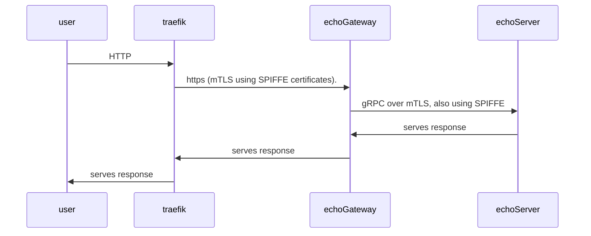

# Traefik + SPIRE + gRPC:

## What's in the box?

This demo install a spire server, an agent as well as a k8s-workload-registrar that automatically registers pods as workload on the spiffe server.

From there, we deploy 3 components:

- Traefik, as ingress controller, which is able to establish mTLS connections using its SPIFFE certificate. This is a patched version, code changes can be found [here](https://github.com/traefik/traefik/compare/master...jlevesy:traefik:jly/poc-spiffe-support)
- An `echo-gateway` that expose an endpoint over https (with SPIFFE certificates), and makes a gRPC call (also over SPIFFE mTLS) to the echo-server
- An `echo-server` which is a gRPC server listening over mTLS, also with SPIFFE certificates.

Which gives the following sequence:



## Running the Demo

You need ko, k3d and kubectl installed.

```bash
make run

curl -H "Host: echo-gateway.localhost" -d '{"message": "hello there"}' localhost:8000/echo
```
