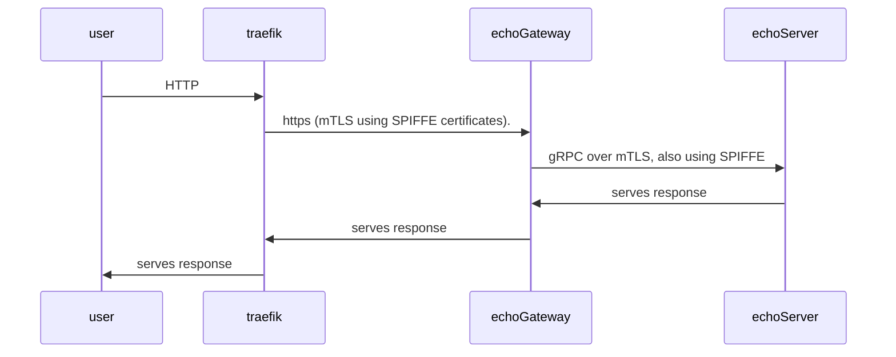
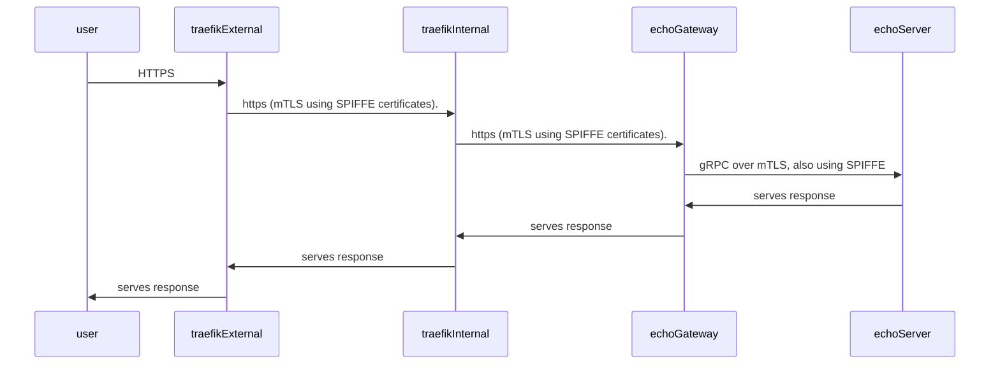

# Traefik + SPIRE + gRPC:

## What's in the box?

This demo install a spire server, an agent as well as a k8s-workload-registrar that automatically registers pods as workload on the spiffe server.

From there, we deploy 4 components:

- `traefik-external` as ingress controller, which is able to establish mTLS connections using its SPIFFE certificate. This is a patched version, code changes can be found [here](https://github.com/traefik/traefik/compare/master...jlevesy:traefik:jly/poc-spiffe-support-server)
- `traefik-internal` as an "internal router", the goal is to demo Traefik - Spiffe integration, by having traefik both serving its x509-SVID and using it as client to call the echo-gateway backend, 
- An `echo-gateway` that expose an endpoint over https (with SPIFFE certificates), and makes a gRPC call (also over SPIFFE mTLS) to the echo-server
- An `echo-server` which is a gRPC server listening over mTLS, also with SPIFFE certificates.

### Direct call from Traefik to the Echo Gateway

Which gives the following sequence:



### Traefik External -> Traefik Internal -> Echo Gateway

This demo also demonstrates a use case where Traefik exposes SPIFFE issued certificates and use it as client to the backend, doing mTLS on both ends.
A quirk I had to fix is to manually set the client hello `serverName` because Traefik doesn't set it automatically when it forwards a request over mTLS (see: https://github.com/traefik/traefik/issues/8828).




## Running the Demo

You need ko, k3d and kubectl installed.

```bash
make run

# To hit the gateway directly
curl -H "Host: echo-gateway.localhost" -d '{"message": "hello there"}' localhost:8000/echo


# To hit the gateway via internal traefik
curl  -H "Host: echo-internal.localhost" -d '{"message": "hello there"}' localhost:8000/echo
```
